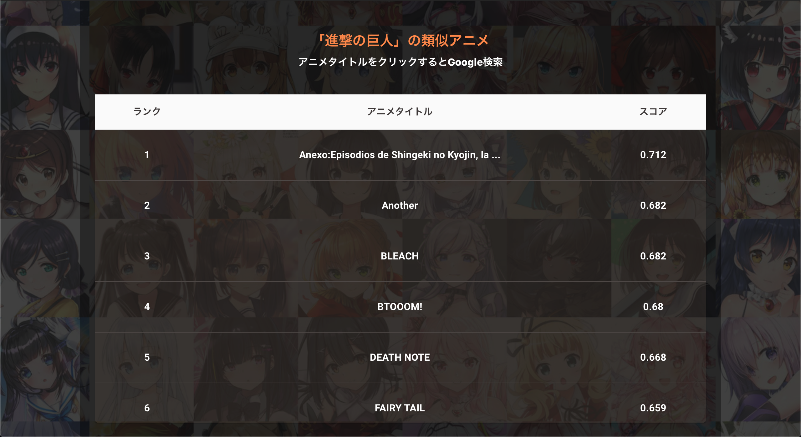

# React-AnimeRecommender

[このレポジトリ ](https://github.com/imoken1122/turicreate-AnimeRecommender) で作ったアニメレコメンダー
をWeb上でデモとして遊べるように React と FastAPI を用いて作成. 

FastAPI によるバックエンドの実装は[こちら](https://github.com/imoken1122/fastAPI-recommender)

Heroku にデプロイしたデモが[こちら](https://arncmd.herokuapp.com/)

 

## 環境
- npm 7.3.0
- React 17.0.2

 

## プレビュー

 

背景のイラストは, Kaggleに置いてある[another-anime-face-dataset](https://www.kaggle.com/scribbless/another-anime-face-dataset) から拝借しました

